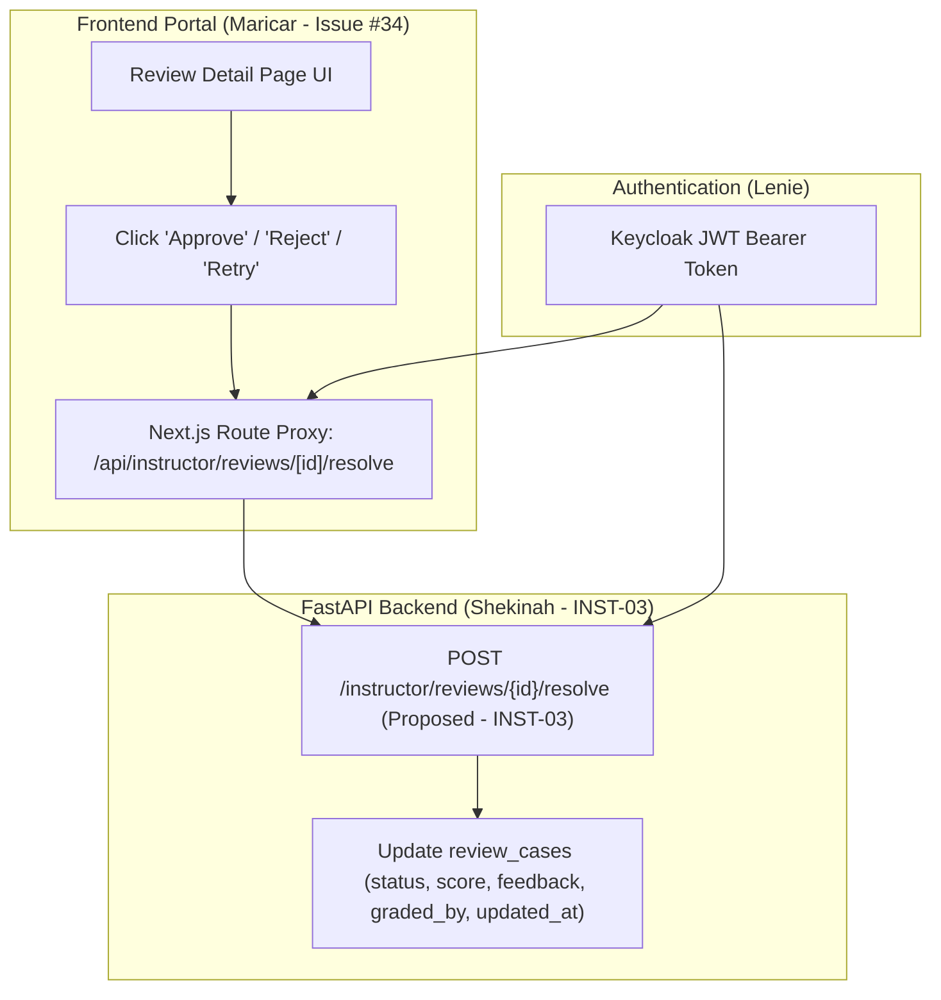

# Instructor API Handoff & Integration Specification

**Author:** Shekinah (Backend / Instructor API & Review Engine)
**Recipients:** Maricar (Frontend UI Lead), Lenie (Auth & Security Lead)
**Date:** September 17, 2026
**Status:** Completed (`DB-01`, `INST-API`, `AUTH-02`); Queued (`INST-03`)
**Context:** Backend contract support for **Issue #34**, which remains owned by **Maricar**.

> [!IMPORTANT]
> **PR Notice:** This pull request provides backend contract support and documentation preparation for Issue #34. It does **not** close Issue #34, which remains actively owned by Maricar for frontend screen implementation and evaluation workflow completion.

**Target Codebase:** [cyberrange/src/provisioning](../src/provisioning) and [cyberrange/portal](../portal)

---

## 1. Executive Summary & Context

The backend infrastructure for database persistence (`DB-01`), Instructor API endpoints (`INST-API`), and FastAPI role-based access control guards (`AUTH-02`) has been successfully implemented, audited, and verified with 100% test suite pass rates (26 review tests in [test_reviews.py](../src/provisioning/test_reviews.py) and 12 persistence tests in [test_score_persistence.py](../src/provisioning/test_score_persistence.py)).

This handoff document provides Maricar with exact field-level API mappings to her planned UI route shells (`/instructor`, `/instructor/reviews`, `/instructor/reviews/[id]`, `/instructor/students`, `/instructor/pods`), sanitized request and response payloads, error models, and integration instructions. It also reviews the authorization checklist and role contracts with Lenie, and documents the existing Approve/Reject/Retry data structures along with the remaining gaps queued for `INST-03`.

### 1.1 Recorded Test Verification Evidence
The cited test suites were executed against the active Python 3.14 / pytest runtime and passed with zero errors:

```text
============================= test session starts =============================
platform win32 -- Python 3.14.7, pytest-9.1.1, pluggy-1.6.0
rootdir: cyberrange
configfile: pyproject.toml
plugins: anyio-4.15.1
collected 26 items

src/provisioning/test_reviews.py ..........................              [100%]
====================== 26 passed, 10 warnings in 11.47s =======================

============================= test session starts =============================
platform win32 -- Python 3.14.7, pytest-9.1.1, pluggy-1.6.0
rootdir: cyberrange
configfile: pyproject.toml
plugins: anyio-4.15.1
collected 12 items

src/provisioning/test_score_persistence.py ............                  [100%]
============================= 12 passed in 2.54s ==============================
```

---

## 2. API Field Mapping to Planned UI Screens

### 2.1 Scenario Catalog & Preserved Scenario Mapping
In the cyber range curriculum and portal documentation, scenarios are mapped as follows:
- **Scenario 1:** Network Reconnaissance (`scenario_id = 1`, [scenario_01_network_reconnaissance.md](../portal/public/scenarios/scenario_01_network_reconnaissance.md))
- **Scenario 2 → Internal Scenario 06:** Web Application Attack SQL Injection / DVWA (`scenario_id = 6`, [scenario_06_web_application_attack_sql_injection.md](../portal/public/scenarios/scenario_06_web_application_attack_sql_injection.md))
- **Scenario 3:** SIEM Alert Triage and Log Analysis (`scenario_id = 9`, [scenario_09_siem_alert_triage_and_log_analysis.md](../portal/public/scenarios/scenario_09_siem_alert_triage_and_log_analysis.md))
- **Scenario 4:** Vulnerability Hardening (`scenario_id = 11`, [scenario_11_vulnerability_hardening.md](../portal/public/scenarios/scenario_11_vulnerability_hardening.md))

> [!NOTE]
> **Preserved Scenario Mapping:** In Maricar's mock data and screens, **Scenario 2 maps directly to internal scenario 06** (`scenario_id = 6`, SQL Injection). This mapping is preserved across all API endpoints, database records, and UI components.

---

### 2.2 Screen: Instructor Overview / Dashboard (`/instructor` or `/instructor/dashboard`)
Planned by Maricar in [portal/src/app/instructor/page.tsx](../portal/src/app/instructor/page.tsx) and [instructorMock.ts](../portal/src/lib/mock/instructorMock.ts).

| UI Element / Mock Field | Backend API Source | API Field Name | Type / Format | Notes / Transformation |
| :--- | :--- | :--- | :--- | :--- |
| **Total Enrolled Students** (`stat.value`) | `GET /instructor/students` | `students.length` | `integer` | Count of unique students across verifications, active pods, and review cases. |
| **Pending Reviews** (`pendingCount`) | `GET /instructor/reviews?status_filter=PENDING` or `GET /instructor/students` | `reviews.length` or `sum(pending_review_count)` | `integer` | High-priority count of reports requiring instructor grading. *Advisory:* Backend `pending_review_count` aggregates `status = 'PENDING'`. If Maricar wishes to include `RETRY` cases in dashboard pending totals, filter or aggregate accordingly on the client. |
| **Active Pods** (`activePods`) | `GET /instructor/pods` | `pods.length` | `integer` | Active LXD slots currently occupied (`0` to `MAX_PODS = 6`). |
| **Review Queue Preview Table** | `GET /instructor/reviews` | `reviews[0..4]` | `array[object]` | Top 4 most recent submissions. |
| ↳ **Case ID** (`c.id`) | `GET /instructor/reviews` | `review_id` | `integer` | Format for UI display as `#REV-{review_id}` or `case-{review_id}`. |
| ↳ **Student** (`c.student`) | `GET /instructor/reviews` | `student_id` | `string` | Student Keycloak username (e.g. `student1`). |
| ↳ **Scenario** (`c.scenario`) | `GET /instructor/reviews` | `scenario_id` | `integer` | Map integer `6` -> `"06 - SQL Injection"` (Scenario 2), `1` -> `"01 - Network Recon"`, etc. |
| ↳ **Submitted At** (`c.submitted`) | `GET /instructor/reviews` | `created_at` | `string (SQLite UTC: YYYY-MM-DD HH:MM:SS)` | Space-separated UTC timestamp. See Section 3.6 for frontend conversion helper (`parseSqliteUtc`). |
| ↳ **Status** (`c.status`) | `GET /instructor/reviews` | `status` | `string` | Backend returns `"PENDING"`, `"APPROVED"`, `"REJECTED"`, `"RETRY"`. Convert to lowercase for UI badge matching. |

---

### 2.3 Screen: Review Queue (`/instructor/reviews`)
Planned in [portal/src/app/instructor/reviews/page.tsx](../portal/src/app/instructor/reviews/page.tsx).

| UI Element / Column | Backend API Source | API Field Name | Type / Format | Notes / Transformation |
| :--- | :--- | :--- | :--- | :--- |
| **Status Filter Tabs** (`PENDING`, `APPROVED`, etc.) | `GET /instructor/reviews?status_filter={STATUS}` | Query Parameter `status_filter` | `string` | Pass `PENDING`, `APPROVED`, `REJECTED`, `RETRY`. Omit parameter for `ALL`. *Note:* Unrecognized/invalid status values currently return HTTP 200 with an empty queue (`{"reviews": []}`) rather than HTTP 400 (see GAP-10). |
| **Case ID** | `GET /instructor/reviews` | `review_id` | `integer` | Primary key in `review_cases`. |
| **Student** | `GET /instructor/reviews` | `student_id` | `string` | Student identity. |
| **Scenario / Milestone** | `GET /instructor/reviews` | `scenario_id`, `milestone_id` | `integer`, `integer | null` | If `milestone_id` is null, display `Scenario #{scenario_id} · Overall Report`. Note: `scenario_id = 6` corresponds to Scenario 2. |
| **Case Type** | `GET /instructor/reviews` | `case_type` | `string` | `"WRITTEN_REPORT"`, `"SCORING_CONFLICT"`, or `"MANUAL_REVIEW"`. |
| **Submitted** | `GET /instructor/reviews` | `created_at` | `string (SQLite UTC: YYYY-MM-DD HH:MM:SS)` | Submission timestamp. Parse with `parseSqliteUtc()` in Section 3.6. |
| **Status Badge** | `GET /instructor/reviews` | `status` | `string` | Color code: `PENDING` (amber), `APPROVED` (green), `RETRY` (blue), `REJECTED` (red). |
| **Score Assigned** | `GET /instructor/reviews` | `score` | `integer | null` | `null` indicates unreviewed/ungraded. Range `0..100`. |
| **Action Link** | UI Navigation | — | — | Link destination: `/instructor/reviews/${review_id}`. |

---

### 2.4 Screen: Review Detail & Evaluation (`/instructor/reviews/[id]`)
Planned in [portal/src/app/instructor/reviews/[id]/page.tsx](../portal/src/app/instructor/reviews/[id]/page.tsx).

| Screen Section | Backend API Field | Type | Description & Frontend Handling |
| :--- | :--- | :--- | :--- |
| **Header Meta** | `review_id`, `student_id`, `scenario_id`, `milestone_id`, `status` | `number`, `string`, `number`, `number`, `string` | Shows target student, scenario/milestone identifiers, and current resolution badge. |
| **Case Type & Reason** | `case_type`, `report_text`, `conflict_reason` | `string`, `string | null`, `string | null` | If `case_type == "WRITTEN_REPORT"`, display `report_text` in student writeup box.<br>If `case_type == "SCORING_CONFLICT"`, display `conflict_reason`. |
| **Student Evidence** | `evidence_data` | `string | null` (JSON string) | Contains student commands, terminal outputs, or exploit payload proof. Parse with `JSON.parse()` if valid JSON, otherwise render as pre-formatted text. |
| **Automated Verifier Evidence** | Correlated from `milestone_verification` via `GET /instructor/students/{student_id}` | `object` (`status`, `detection_score`, `verified_at`) | Shows whether automated scoring passed or failed and any Wazuh detection score recorded. Correlated independently without modifying verification tables. |
| **Instructor Notes** | `feedback` | `string | null` | Existing instructor evaluation remarks, retry instructions, or grading justification. |
| **Persisted Evaluator** | `graded_by` | `string | null` | Keycloak username of instructor who resolved or graded this case. |
| **Score Points** | `score` | `integer | null` | Points awarded (`0` to `100`). Remains `null` while `status == 'PENDING'`. |
| **Timestamps** | `created_at`, `updated_at` | `string (SQLite UTC: YYYY-MM-DD HH:MM:SS)` | Submission date and last review update timestamp. Note: Prior to resolution in Issue #35 (`INST-03`), `updated_at` remains identical to `created_at`. Parse with `parseSqliteUtc()`. |
| **Decision Buttons** | Proposed action via `POST /instructor/reviews/{id}/resolve` (to be implemented in INST-03) | Action Payload | Proposed decisions: `Approve` (`score=100`, `status='APPROVED'`), `Reject` (`score=0`, `status='REJECTED'`), `Request Retry` (`status='RETRY'`). |

---

### 2.5 Screen: Student Roster & Progress (`/instructor/students`)
Planned in [portal/src/app/instructor/students/page.tsx](../portal/src/app/instructor/students/page.tsx).

| UI Element | Backend API Field (`GET /instructor/students`) | Type | Notes & Calculations |
| :--- | :--- | :--- | :--- |
| **Student ID** | `student_id` | `string` | Unique username from Keycloak. |
| **Active Pod Status** | `active_pod` | `object | null` | `null` if student has no running container pod.<br>If object: contains `pod_id`, `scenario_id`, `status`, `remaining_seconds`. |
| **Pod Slot & TTL** | `active_pod.pod_id`, `active_pod.remaining_seconds` | `number`, `number` | Display active slot (e.g. `Slot #3`) and format `remaining_seconds` into `mm:ss`. |
| **Completed Milestones** | `milestones` | `array[object]` | Array of `{scenario_id, milestone_id, status, detection_score, verified_at}` from automated verifications. |
| **Progress % Calculation** | `milestones.filter(m => m.status === 'PASS').length` | `number` | Compute ratio of passed automated milestones against total scenario milestones. |
| **Pending Reviews** | `pending_review_count` | `integer` | Number of reviews with PENDING status for this student. Alert badge if `> 0`. |
| **Last Activity** | `milestones[0].verified_at` or `active_pod.created_at` | `string (SQLite UTC: YYYY-MM-DD HH:MM:SS)` | Most recent student event recorded in database. Parse with `parseSqliteUtc()`. |

---

### 2.6 Screen: Active Student Pods (`/instructor/pods`)
Planned by Maricar in [portal/src/app/instructor/pods/page.tsx](../portal/src/app/instructor/pods/page.tsx) (*Note:* Route shell and API proxy are currently missing on `origin/main`; see GAP-02).

| Field | Source (`GET /instructor/pods`) | Type | Security & RBAC Guarantees |
| :--- | :--- | :--- | :--- |
| `pod_id` | `pod.pod_id` | `integer` (1..6) | Pod slot number. |
| `student_id` | `pod.student_id` | `string` | Student owner. |
| `scenario_id` | `pod.scenario_id` | `integer` | Scenario currently running in containers (e.g. `6` for Scenario 2). |
| `status` | `pod.status` | `string` | `ACTIVE`, `PROVISIONING`, `DESTROYING`. |
| `remaining_seconds` | `pod.remaining_seconds` | `integer` | Auto-teardown countdown. |
| `milestones` | `pod.milestones` | `array[object]` | Automated scoring verification history for this active pod. |
| **Sanitization** | Stripped by `serialize_instructor_pod` | — | Internal LXD identifiers (`vmid_kali`, `vmid_meta`, `vmid_dvwa`), Guacamole `connection_id`, and Wazuh agent tokens are purged from this response. |

---

## 3. Sanitized Response Payloads

All endpoint hostnames in the examples below use environment-based or generic placeholders (e.g. `${PROVISION_API_URL}` or `api.cyberrange.local:8000`).

### 3.1 Review Queue List (`GET /instructor/reviews`)

```http
GET /instructor/reviews HTTP/1.1
Host: api.cyberrange.local:8000
Authorization: Bearer <INSTRUCTOR_JWT_TOKEN>
```

```json
{
  "reviews": [
    {
      "review_id": 142,
      "student_id": "student_juan",
      "scenario_id": 6,
      "milestone_id": 2,
      "case_type": "WRITTEN_REPORT",
      "report_text": "Identified SQL injection in DVWA login (Scenario 2). Tested `' OR '1'='1` bypass which allowed bypassing authentication and dumped user credentials table.",
      "conflict_reason": null,
      "evidence_data": "{\"payload\": \"admin' OR '1'='1#\", \"extracted_user\": \"admin\", \"hash_prefix\": \"$6$rounds=5000$\"}",
      "score": null,
      "status": "PENDING",
      "feedback": null,
      "graded_by": null,
      "created_at": "2026-09-17 10:15:22",
      "updated_at": "2026-09-17 10:15:22"
    },
    {
      "review_id": 141,
      "student_id": "student_pedro",
      "scenario_id": 11,
      "milestone_id": 1,
      "case_type": "SCORING_CONFLICT",
      "report_text": null,
      "conflict_reason": "Automated verification timed out during SSH root login check, but SSH config was hardened according to manual instructions.",
      "evidence_data": "{\"sshd_config_snippet\": \"PermitRootLogin no\\nPasswordAuthentication no\", \"service_status\": \"sshd is running\"}",
      "score": null,
      "status": "PENDING",
      "feedback": null,
      "graded_by": null,
      "created_at": "2026-09-17 09:40:05",
      "updated_at": "2026-09-17 09:40:05"
    },
    {
      "review_id": 139,
      "student_id": "student_maria",
      "scenario_id": 1,
      "milestone_id": 3,
      "case_type": "WRITTEN_REPORT",
      "report_text": "Completed network reconnaissance using advanced Nmap timing templates.",
      "conflict_reason": null,
      "evidence_data": "{\"command\": \"nmap -sV -sC -p- 10.10.10.5\", \"output_summary\": \"All ports identified\"}",
      "score": 60,
      "status": "RETRY",
      "feedback": "Partial credit awarded. Please document how you bypassed firewall filtering before full approval.",
      "graded_by": "instructor_demo",
      "created_at": "2026-09-16 16:30:00",
      "updated_at": "2026-09-16 17:10:14"
    },
    {
      "review_id": 130,
      "student_id": "student_juan",
      "scenario_id": 6,
      "milestone_id": 1,
      "case_type": "WRITTEN_REPORT",
      "report_text": "Completed reconnaissance and identified vulnerable SQL injection parameters on DVWA login form.",
      "conflict_reason": null,
      "evidence_data": "{\"vulnerable_param\": \"username\", \"dbms\": \"MySQL / MariaDB\"}",
      "score": 100,
      "status": "APPROVED",
      "feedback": "Excellent port scan analysis and parameter identification.",
      "graded_by": "instructor_demo",
      "created_at": "2026-09-15 11:20:00",
      "updated_at": "2026-09-15 14:05:30"
    }
  ]
}
```

---

### 3.2 Review Detail: Written Report (`GET /instructor/reviews/142`)

```http
GET /instructor/reviews/142 HTTP/1.1
Host: api.cyberrange.local:8000
Authorization: Bearer <INSTRUCTOR_JWT_TOKEN>
```

```json
{
  "review_id": 142,
  "student_id": "student_juan",
  "scenario_id": 6,
  "milestone_id": 2,
  "case_type": "WRITTEN_REPORT",
  "report_text": "Identified SQL injection in DVWA login (Scenario 2). Tested `' OR '1'='1` bypass which allowed bypassing authentication and dumped user credentials table.",
  "conflict_reason": null,
  "evidence_data": "{\"payload\": \"admin' OR '1'='1#\", \"extracted_user\": \"admin\", \"hash_prefix\": \"$6$rounds=5000$\"}",
  "score": null,
  "status": "PENDING",
  "feedback": null,
  "graded_by": null,
  "created_at": "2026-09-17 10:15:22",
  "updated_at": "2026-09-17 10:15:22"
}
```

---

### 3.3 Review Detail: Scoring Conflict Resolution (`GET /instructor/reviews/141`)

```http
GET /instructor/reviews/141 HTTP/1.1
Host: api.cyberrange.local:8000
Authorization: Bearer <INSTRUCTOR_JWT_TOKEN>
```

```json
{
  "review_id": 141,
  "student_id": "student_pedro",
  "scenario_id": 11,
  "milestone_id": 1,
  "case_type": "SCORING_CONFLICT",
  "report_text": null,
  "conflict_reason": "Automated verification timed out during SSH root login check, but SSH config was hardened according to manual instructions.",
  "evidence_data": "{\"sshd_config_snippet\": \"PermitRootLogin no\\nPasswordAuthentication no\", \"service_status\": \"sshd is running\"}",
  "score": 100,
  "status": "APPROVED",
  "feedback": "Confirmed that sshd configuration was modified correctly and verifier encountered transient network timeout. Evaluated report as passed.",
  "graded_by": "instructor_demo",
  "created_at": "2026-09-17 09:40:05",
  "updated_at": "2026-09-17 11:02:18"
}
```

---

### 3.4 Correlated Automated Verifier Evidence (`GET /instructor/students/student_pedro`)

When rendering the verifier evidence card in `/instructor/reviews/[id]`, the frontend correlates the review's `scenario_id` and `milestone_id` with the student's historical `milestones` verification records:

```json
{
  "student_id": "student_pedro",
  "active_pod": {
    "pod_id": 2,
    "student_id": "student_pedro",
    "scenario_id": 11,
    "status": "ACTIVE",
    "remaining_seconds": 3120,
    "created_at": "2026-09-17 09:15:00"
  },
  "milestones": [
    {
      "scenario_id": 11,
      "milestone_id": 1,
      "status": "FAIL",
      "detection_score": 0,
      "verified_at": "2026-09-17 09:35:10"
    }
  ],
  "reviews": [
    {
      "review_id": 141,
      "scenario_id": 11,
      "milestone_id": 1,
      "case_type": "SCORING_CONFLICT",
      "status": "APPROVED",
      "score": 100
    }
  ]
}
```

---

### 3.5 Error Payloads & Status Codes

All backend endpoints use standardized HTTP status codes and structured RFC-compliant JSON responses:

#### 1. 400 Bad Request (Validation Failure)
```json
{
  "detail": "Invalid case_type: must be one of ('WRITTEN_REPORT', 'SCORING_CONFLICT', 'MANUAL_REVIEW')"
}
```
Or for empty student reports:
```json
{
  "detail": "report_text cannot be empty for WRITTEN_REPORT"
}
```

#### 2. 401 Unauthorized (Missing or Invalid Bearer Token)
```json
{
  "detail": "Missing or malformed Authorization header"
}
```
Or when token is expired:
```json
{
  "detail": "Invalid or expired token"
}
```

#### 3. 403 Forbidden (RBAC Role Violation)
Returned when a user with only `student` role attempts to access `/instructor/*` or `/admin/*`:
```json
{
  "detail": "Forbidden: Insufficient privileges"
}
```

#### 4. 404 Not Found (Resource Does Not Exist or Ownership Mismatch)
```json
{
  "detail": "Review case not found"
}
```
Or when student is not found in roster:
```json
{
  "detail": "Student not found"
}
```

#### 5. 503 Service Unavailable (Auth Introspection Failure or Host Capacity Full)
```json
{
  "detail": "Auth service unavailable"
}
```
Or when LXD slot cap is reached:
```json
{
  "detail": "POD_CAP_REACHED"
}
```

### 3.6 SQLite Timestamp Serialization & Frontend Conversion Guidance

All timestamps stored in the backend SQLite database (`created_at`, `updated_at`, `verified_at`) are generated via SQLite's `CURRENT_TIMESTAMP` in UTC format:
```text
YYYY-MM-DD HH:MM:SS (e.g. "2026-09-17 10:15:22")
```

> [!WARNING]
> **JavaScript Parsing Hazard:** Standard browser `new Date("YYYY-MM-DD HH:MM:SS")` is non-standard across engines. In particular, some browsers parse space-separated strings as local time instead of UTC, or return `Invalid Date`.

Frontend developers should use the following null-safe helper to normalize SQLite UTC space-separated strings into ISO-8601 UTC before instantiating `Date`:

```typescript
/**
 * Parses SQLite's space-formatted UTC timestamps ('YYYY-MM-DD HH:MM:SS')
 * and ISO-8601 timestamps that already include `Z` or a numeric UTC offset.
 * Returns null for missing, blank, or invalid input.
 */
export function parseSqliteUtc(utcStr: string | null | undefined): Date | null {
  const value = utcStr?.trim();
  if (!value) return null;

  const sqliteUtcPattern = /^\d{4}-\d{2}-\d{2} \d{2}:\d{2}:\d{2}(?:\.\d+)?$/;
  const normalized = sqliteUtcPattern.test(value)
    ? `${value.replace(" ", "T")}Z`
    : value;
  const parsed = new Date(normalized);

  return Number.isNaN(parsed.getTime()) ? null : parsed;
}
```

---

## 4. Proposed Approve/Reject/Retry Behavior & Existing Field Persistence Model

### 4.1 Schema & Storage Design (Database Level - `DB-01`)
The `review_cases` table is defined in [cyberrange/src/provisioning/schema/v4.sql](../src/provisioning/schema/v4.sql) and migrated via [migrate.py](../src/provisioning/migrate.py):

```sql
CREATE TABLE IF NOT EXISTS review_cases (
    review_id       INTEGER PRIMARY KEY AUTOINCREMENT,
    student_id      TEXT NOT NULL,
    scenario_id     INTEGER NOT NULL,
    milestone_id    INTEGER,
    case_type       TEXT CHECK(case_type IN ('WRITTEN_REPORT','SCORING_CONFLICT','MANUAL_REVIEW')) DEFAULT 'WRITTEN_REPORT',
    report_text     TEXT,
    conflict_reason TEXT,
    evidence_data   TEXT,
    score           INTEGER CHECK(score IS NULL OR (score >= 0 AND score <= 100)),
    status          TEXT CHECK(status IN ('PENDING','APPROVED','REJECTED','RETRY')) DEFAULT 'PENDING',
    feedback        TEXT,
    graded_by       TEXT,
    created_at      TIMESTAMP DEFAULT CURRENT_TIMESTAMP,
    updated_at      TIMESTAMP DEFAULT CURRENT_TIMESTAMP
);
```

> [!IMPORTANT]
> **Resolution Persistence State (Pre-Issue #35 / INST-03):** In current review case submissions, `score`, `feedback`, and `graded_by` are initialized to `NULL`, and `updated_at` defaults to `created_at`. These fields remain unpopulated until the instructor resolution endpoint (`POST /instructor/reviews/{id}/resolve`) is implemented in Issue #35 / task `INST-03`.

### 4.2 Proposed Resolution Endpoint Specification (`POST /instructor/reviews/{review_id}/resolve`)
The resolution endpoint does not exist in current `origin/main` and is a **proposed endpoint that `INST-03` must implement**. The proposed contract specification to update the persisted review case is as follows:

- **Method / Path:** `POST /instructor/reviews/{review_id}/resolve`
- **Guards:** Requires `instructor` or `admin` role.
- **Request Body Contract:**
```json
{
  "status": "APPROVED",
  "score": 100,
  "feedback": "Confirmed that the injection bypass payload and dumped table hashes match the milestone criteria."
}
```
- **Validation Rules:**
  - `status`: Must be one of `"APPROVED"`, `"REJECTED"`, `"RETRY"`.
  - `score`: Integer between `0` and `100` inclusive, or `null`.
    - For `status == "APPROVED"`, `score` is required (typically `0..100`, default `100`).
    - For `status == "REJECTED"`, `score` is typically `0`.
    - For `status == "RETRY"`, `score` is optional / nullable (or partial credit if awarded).
  - `feedback`: Optional text note providing feedback or retry instructions.
- **Persisted Updates:**
  - `status` updated to evaluated decision (`APPROVED`, `REJECTED`, or `RETRY`).
  - `score` updated to assigned score.
  - `feedback` persisted with instructor notes.
  - `graded_by` persisted with instructor's username from validated JWT claims.
  - `updated_at` updated to `CURRENT_TIMESTAMP`.
- **Response Contract:**
```json
{
  "status": "resolved",
  "review_id": 142,
  "decision": "APPROVED"
}
```

---

## 5. Review with Lenie: Authorization, Role Contracts & Demo Accounts

### 5.1 Shekinah’s Authorization Checklist for Lenie
Lenie should verify that the backend RBAC implementation meets all security requirements:

- [x] **FastAPI RBAC Dependency Enforced:** All instructor endpoints in [pods_router.py](../src/provisioning/pods_router.py) enforce `auth.require_role(["instructor", "admin"], claims)`.
- [x] **Multi-Source Role Extraction:** `auth.extract_roles(claims)` in [auth.py](../src/provisioning/auth.py) extracts roles from both Keycloak realm access (`claims["realm_access"]["roles"]`) and portal client access (`claims["resource_access"]["portal"]["roles"]`).
- [x] **Tenant & Client Isolation:** Roles belonging to foreign or unrelated clients (e.g., `claims["resource_access"]["unrelated-client"]`) are strictly ignored and do not grant access (verified by `test_unrelated_client_role_does_not_grant_access`).
- [x] **Fail-Closed Default:** If `AUTH_ENABLED=true` and an unauthenticated or invalid token is supplied, endpoints immediately return HTTP 401. If the token is valid but lacks `instructor` or `admin`, endpoints immediately return HTTP 403.
- [x] **Student Data Isolation:** Student-facing endpoints continue to enforce `require_owner(pod, claims)`, ensuring students cannot access or destroy peer instances.
- [x] **Payload Minimization:** `serialize_instructor_pod` strips infrastructure VM IDs (`vmid_*`), Guacamole `connection_id`, and `wazuh_agent_id` before returning active pod lists.

### 5.2 Review of Lenie’s Role Contract (`AUTH-01` / `AUTH-02` / `AUTH-03`)
- **Frozen Role Contract:** Authoritative application roles, noise-role exclusions, and prototype account assignments are frozen in [AUTH-03-role-contract.md](./AUTH-03-role-contract.md).
- **Token Decoding:** In [portal/src/lib/auth.ts](../portal/src/lib/auth.ts), NextAuth extracts `realm_access.roles` on initial OIDC token generation and on session refreshes.
- **Session Types:** In [portal/src/types/next-auth.d.ts](../portal/src/types/next-auth.d.ts), `session.roles` and `session.user.roles` are typed as `string[]` to accommodate Keycloak default roles (`default-roles-cyber-range`, `offline_access`, `uma_authorization`) without type errors.
- **Navigation Guard:** In [portal/src/components/layout/Sidebar.tsx](../portal/src/components/layout/Sidebar.tsx), sidebar items for Instructor Portal (`/instructor/*`) render only if `roles.includes("instructor") || roles.includes("admin")`. In addition, request-time route protection in [portal/src/middleware.ts](../portal/src/middleware.ts) and render-time protection in [portal/src/components/auth/AuthGate.tsx](../portal/src/components/auth/AuthGate.tsx) (implemented in PR #81 / `AUTH-04`) enforce role route guards using `requiredRolesForPath()`, redirecting unauthorized users directly to `/dashboard`. *Remaining Limitation:* `getToken()` decrypts the session cookie without per-request Keycloak OIDC introspection, so a role revoked in Keycloak mid-session remains honored until the `jwt()` callback in `lib/auth.ts` re-decodes roles from a refreshed token (near access-token expiry).

### 5.3 Demo-Account Validation Matrix & Checklist

Demo accounts and application realm roles are provisioned and verified via host scripts [deploy/host/create_demo_accounts.sh](../deploy/host/create_demo_accounts.sh) and [deploy/host/verify_demo_accounts.sh](../deploy/host/verify_demo_accounts.sh) per [AUTH-03-role-contract.md](./AUTH-03-role-contract.md).

| Test Account | Keycloak Username | Keycloak Roles | Expected UI Access | Expected API Status |
| :--- | :--- | :--- | :--- | :--- |
| **Student Demo** | `student_demo` | `["student", "default-roles-cyber-range"]` | `/dashboard`, `/scenarios`, `/scenario/[id]` | Allowed: `/pods`, `/reviews/submit`<br>**Denied (403):** `/instructor/*`, `/admin/*` |
| **Instructor Demo** | `instructor_demo` | `["instructor", "default-roles-cyber-range"]` | `/instructor/dashboard`, `/instructor/pods`, `/instructor/reviews`, `/instructor/students` | **Allowed:** `/instructor/*`<br>**Denied (403):** `/admin/system`, `/admin/users` |
| **Admin Demo** | `admin_demo` | `["admin", "default-roles-cyber-range"]` | Full access across Student, Instructor, and Admin views | **Allowed:** `/instructor/*`, `/admin/*`, `/pods` |

#### Step-by-Step Validation Procedure with Lenie:
1. Log in to `${PORTAL_URL}` as `student_demo`. Confirm Instructor and Admin navigation links are hidden in [Sidebar.tsx](../portal/src/components/layout/Sidebar.tsx). Attempt direct navigation to `${PORTAL_URL}/instructor/reviews` (confirm that `middleware.ts` / `AuthGate.tsx` redirect the student to `/dashboard`; any direct underlying API requests remain blocked with HTTP 403).
2. Log in as `instructor_demo`. Confirm the "Instructor Portal" section appears in the sidebar. Verify access to `/instructor/dashboard`, `/instructor/pods`, `/instructor/reviews`, and `/instructor/students`.
3. Verify that issuing a direct `curl` to `${PROVISION_API_URL}/instructor/reviews` with the `student_demo` bearer token returns HTTP 403 `{"detail": "Forbidden: Insufficient privileges"}`.
4. Verify that issuing the same `curl` with the `instructor_demo` bearer token returns HTTP 200 with the review list.

---

## 6. Gap List & Ownership Matrix (Queued for `INST-03`)

> [!NOTE]
> **Scope Boundary Clarification:** Automatic updates to the `milestone_verification` table are **excluded** from the planned `INST-03` scope. The automated scoring engine (`scoring.py` / Wazuh / SSH) and the qualitative review cases engine (`review_cases`) maintain separate records by design.



| # | Identified Gap | Impact / Risk | Planned Resolution (`INST-03`) | Owner |
| :--- | :--- | :--- | :--- | :--- |
| **GAP-01** | **Proposed Resolution Endpoint Implementation:** Route handler `POST /instructor/reviews/{review_id}/resolve` does not exist in `origin/main`. | Instructor review decisions (Approve, Reject, Retry) cannot be submitted to backend until implemented. | Implement the proposed resolution endpoint in [pods_router.py](../src/provisioning/pods_router.py) according to the specification in Section 4.2. | **Shekinah** |
| **GAP-02** | **Missing Portal Next.js API Proxies & Pods Route Shell:** PR #80 (`INST-01`) merged the `/students` and `/students/[id]` route proxies in `portal/src/app/api/instructor/students/` using the shared `proxyToApi()` helper. However, portal still lacks proxy route handlers under `portal/src/app/api/instructor/*` for `/reviews`, `/reviews/[id]`, `/reviews/[id]/resolve`, and `/pods`. In addition, the route shell `portal/src/app/instructor/pods/page.tsx` remains missing on `origin/main`. | Browser cannot reach backend review and pod endpoints with bearer auth, and instructor cannot view active container pods. | Maricar to create the remaining Next.js API proxy routes under `portal/src/app/api/instructor/*` (`/reviews`, `/reviews/[id]`, `/reviews/[id]/resolve`, `/pods`) using the existing `proxyToApi()` helper from `@/lib/apiProxy` (forwarding query parameters such as `?status_filter={STATUS}` via `req.nextUrl.search`, and passing JSON body for `POST .../resolve`). In addition, implement `portal/src/app/instructor/pods/page.tsx`. | **Maricar** |
| **GAP-03** | **Status Casing & Enum Normalization:** Backend database stores uppercase (`"PENDING"`, `"APPROVED"`), whereas mock UI typed lowercase (`"pending"`). | Badge colors and UI filter comparisons fail without normalization. | Add `.toUpperCase()` mapping in frontend review data services and API wrappers. | **Maricar** |
| **GAP-04** | **Evidence Attachment Formatting:** Evidence is currently stored as JSON/text strings in SQLite `evidence_data`. | Format mismatch between UI renderer and stored strings. | Standardize client-side JSON parsing and pre-formatted text fallback using `parseSqliteUtc()` and safe JSON parsing. | **Maricar & Shekinah** |
| **GAP-05** | **Student Retry Resubmission Flow:** Revision path for reviews in `RETRY` status. | Need agreed client path when student revises work. | Implement in-place update or resubmission handling based on Decision 1 below. | **Shekinah & Maricar** |
| **GAP-06** | **[RESOLVED - AUTH-03 / PR #56] Keycloak Realm Roles & Prototype Demo Account Seeding:** PR #56 added [deploy/host/create_demo_accounts.sh](../deploy/host/create_demo_accounts.sh) and [deploy/host/verify_demo_accounts.sh](../deploy/host/verify_demo_accounts.sh), which idempotently create application realm roles (`student`, `instructor`, `admin`) and seed prototype accounts (`student_demo`, `instructor_demo`, `admin_demo`). Dedicated portal client scopes are not needed because roles reach the portal via `realm_access.roles`. | None (Resolved). Environments provision all required roles and accounts via the host scripts. | Completed in AUTH-03 (#56); documented in [AUTH-03-role-contract.md](./AUTH-03-role-contract.md). | **Lenie** |
| **GAP-07** | **Revoked Keycloak Role Mid-Session Latency (Session Cookie Token Refresh):** Role-based route guards in portal middleware and AuthGate (PR #81 / `AUTH-04`) now enforce required roles via `requiredRolesForPath()` and redirect unauthorized users to `/dashboard`. However, NextAuth `getToken()` inspects the decrypted session cookie without re-invoking Keycloak OIDC introspection on every request; consequently, a role revoked in Keycloak mid-session remains honored until the `jwt()` callback in `portal/src/lib/auth.ts` re-decodes roles upon token refresh (near access-token expiry). | If an instructor or admin role is revoked in Keycloak mid-session, the user retains access to protected portal route shells until their NextAuth session token refreshes. (Direct FastAPI requests enforce bearer-token authorization independently. An inactive or expired token returns HTTP 401, while a valid token lacking the required role returns HTTP 403; role-revocation timing still depends on token expiry and Keycloak introspection behavior). | Documented limitation of JWT session cookie caching. Future hardening can introduce periodic background session re-validation or active token revocation introspection if required. | **Lenie & Maricar** |
| **GAP-08** | **Missing Review Submission Catalog & Role Validation:** `POST /reviews/submit` in `pods_router.py` does not validate that `scenario_id` exists in the curriculum catalog, does not validate `milestone_id` against valid scenario milestones, and does not enforce caller `student` role. | Callers with arbitrary roles can submit reviews with non-existent scenario/milestone IDs, corrupting review queue data. | Add scenario/milestone catalog boundary validation and enforce `auth.require_role(["student"], claims)` on `POST /reviews/submit`. | **Shekinah** |
| **GAP-09** | **Unbounded Evidence Payloads & Missing Endpoint Pagination:** Backend request models lack maximum length limits on `report_text`, `conflict_reason`, and `evidence_data`. Additionally, `GET /instructor/reviews` returns full evidence payloads for all rows rather than lightweight queue projections, and neither review nor student list endpoints support pagination (`limit`/`offset`). | Large report, conflict-reason, and evidence values risk memory exhaustion and slow queue load times as review cases accumulate. | Enforce explicit maximum string lengths for `report_text`, `conflict_reason`, and `evidence_data` in `ReviewSubmitRequest`, project lightweight summaries in `GET /instructor/reviews` (reserving full evidence for the detail route), and implement query pagination. | **Shekinah** |
| **GAP-10** | **Status Filter Query Parameter Validation:** `GET /instructor/reviews?status_filter=...` binds the query parameter directly into SQL (`WHERE status = ?`) without validating against allowed enum values (`PENDING`, `APPROVED`, `REJECTED`, `RETRY`). | Invalid query parameters (e.g. `?status_filter=INVALID`) return HTTP 200 with an empty queue (`{"reviews": []}`) instead of returning HTTP 400 Bad Request. | Add Pydantic or FastAPI Query enum validation rejecting invalid statuses with HTTP 400. | **Shekinah** |
| **GAP-11** | **Hardcoded Gateway IP Fallback in Portal Middleware:** In `portal/src/middleware.ts` (line 20), helper `publicOrigin` falls back to hardcoded `http://10.115.77.12` when `NEXTAUTH_URL` and `Host` headers are missing or evaluate to `0.0.0.0`. | Hardcoded lab subnet IP breaks portability and risks redirect failures in different deployment topologies. | Replace hardcoded fallback with mandatory environment configuration (`NEXTAUTH_URL`) or relative redirect handling. | **Lenie & Maricar** |

---

## 7. Integration & Verification Checklist

Maricar and Lenie can use this checklist during frontend hookup:

- [ ] **Step 1: Next.js API Routes:** PR #80 added `/students` and `/students/[id]`. Maricar creates the remaining route proxies under `portal/src/app/api/instructor/*` (`/reviews`, `/reviews/[id]`, `/reviews/[id]/resolve`, `/pods`) forwarding to `${PROVISION_API_URL}/instructor/*` with header `Authorization: Bearer ${session.accessToken}` using the existing `proxyToApi()` helper from `@/lib/apiProxy` (forwarding `req.nextUrl.search` for status filters such as `?status_filter={STATUS}`, and passing JSON request body for `POST .../resolve`).
- [ ] **Step 2: Review Queue Render:** Verify `/instructor/reviews` renders live cases from the backend SQLite database instead of `mockReviewQueue`.
- [ ] **Step 3: Review Detail Render:** Verify `/instructor/reviews/[id]` renders `report_text`, `conflict_reason`, and parsed `evidence_data`. Note scenario mapping (Scenario 2 → scenario 06).
- [ ] **Step 4: Student Roster Render:** Verify `/instructor/students` displays active pods, completed automated milestone counts, and pending review counts.
- [ ] **Step 5: RBAC Verification:** Confirm student login cannot see or access any instructor routes. Confirm `instructor_demo` can see all 4 instructor views.
- [ ] **Step 6: Resolution Implementation (`INST-03`):** Shekinah implements the proposed `POST /instructor/reviews/{review_id}/resolve` endpoint to complete Maricar's review evaluation button actions.

---

## 8. Open Workflow Decisions (Pending Alignment for `INST-03`)

The following workflow decisions remain explicitly **OPEN** and pending consensus between backend and frontend leads:

### Decision 1 [OPEN]: Student Retry Resubmission Lifecycle
- **Problem Statement:** When an instructor sets a case to `status = 'RETRY'`, what is the student's revision lifecycle?
- **Option A (Recommended):** In-place update via `PATCH /reviews/{id}` (or `POST /reviews/{id}/resubmit`). The original `review_id` is updated back to `status = 'PENDING'` with the revised `report_text` and updated timestamp, preserving existing review notes and audit history.
- **Option B:** Append-only new submission via `POST /reviews/submit` containing `parent_review_id = {id}`. The original case remains in `RETRY` status and a fresh case `#REV-{new_id}` is appended to the queue.
- **Status:** **OPEN** (Awaiting agreement between Shekinah, Maricar, and Lenie).

### Decision 2 [OPEN]: Frontend Resolution Handling & Optimistic State
- **Problem Statement:** How should the UI respond immediately after the instructor clicks "Submit Evaluation"?
- **Option A (Optimistic UI):** Immediately update the local state in the review detail and queue views to show the new badge (`APPROVED`/`REJECTED`/`RETRY`), updating the pending count badge before the server response completes.
- **Option B (Server Confirmed):** Display loading spinner on the submit button until the backend returns HTTP 200, followed by a toast notification and re-fetching the updated review record.
- **Status:** **OPEN** (Awaiting agreement between Maricar and Shekinah).
